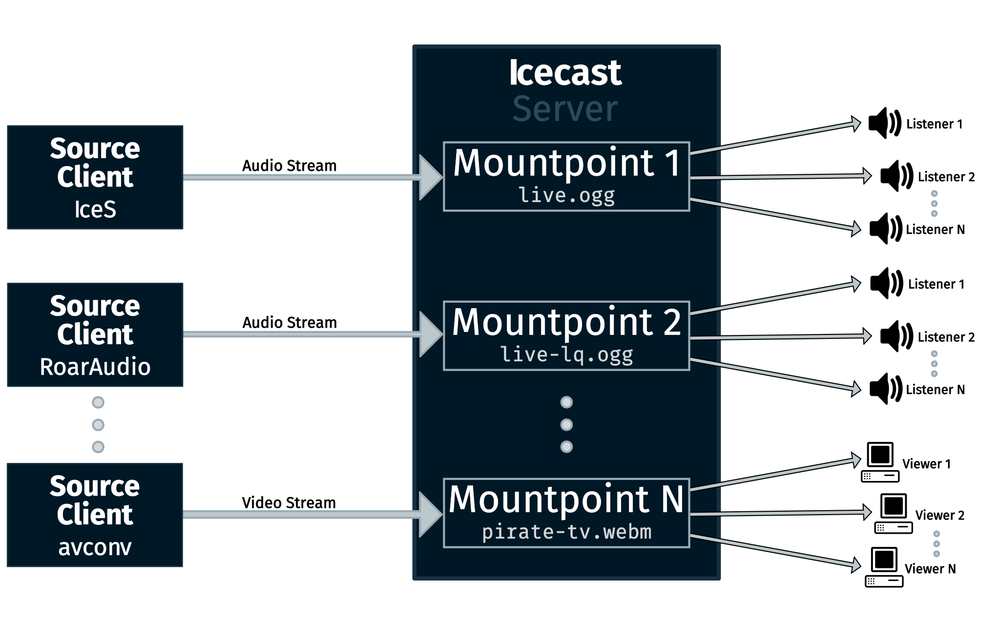

# Basic Requirements

This section will describe the essential requirements in setting up a simple Internet radio station. It is by no means a complete list but should give you enough to get started. Please also note that those are generic instructions. If you installed a Linux/Unix distribution package, then it will likely come with different paths, different means of starting it, etc. In that case please also refer to the documentation of that distribution and or a distribution specific How-To.

As already explained in the Introduction, there are two major components involved: The streaming server (Icecast in this case) and the source client.

The following diagram shows how Icecast works:

A Source Client (i.e. IceS, RoarAudio, …) connects to a mountpoint on the Icecast server and sends audio or video data to it. Listeners connect to the mountpoint and Icecast send the stream to them.
The Icecast server will be the place where all listeners of your stream will connect. The source client (in general) runs on a separate machine than Icecast, but does not necessarily need to.

# The Basics

Each Icecast server can house multiple streams, we call these mountpoints. A mountpoint is a unique name on your server identifying a particular stream - it looks like a filename, such as /stream.ogg and a listener can only listen to a single mountpoint at a time. This means you can have a single Icecast server contain multiple broadcasts with different content, or possibly the same broadcast but with streams of different bitrates or qualities. In this case each broadcast or stream is a separate mountpoint.

# Setting up Icecast

At this point, the steps outlined here related to the Unix version or Win32 console version of Icecast. Icecast is also available in a Win32 GUI version, and the steps are similar in setup, but not quite the same.

The first step in the process is to install the Icecast server itself. The recommended way to do this is using the distro packages, or in case of Win32 download the binary package or installer. How to do this is not contained within this documentation.
After installation there is placed a sample config file named `icecast.xml` in either `/usr/local/etc`, `/etc/` or `/etc/icecast2/` (for UNIX) or in the current working directory, in a folder called `etc`, in case you are using the Window binary package.

The next step is to edit the `icecast.xml` config file and set the appropriate values. Most of the specified values in the samples are fine, for a basic setup the following entries should be specified, and if neccessary, changed to suite your situation:

`<hostname>` - DNS name or IP address used for stream directory listings.  
`<source-password>` - Will be used for the source client authentication.  
`<admin-password>` - Will be used for authenticating admin features of Icecast.  
`<listen-socket>` (both port and bind-address)  
If you expect many listeners, make sure to adjust the `<clients>` limit in the `<limits>` block.  
Additionally make sure to note where the Icecast log file is stored, see the `<logdir>` value in the `<paths>` section.

Once the configuration file is modified, you should be able to start the server with the following command

    icecast -c /path/to/icecast.xml

If no error messages are generated, then check the `error.log` file in the log directory for the ‘server started’ message, it will look something like:

    [2014-11-20  19:17:48] INFO main/main Icecast 2.4.1 server started

You may notice slight variations to the line above, but the key thing here is that the server is started, logging is working and the version is shown.  
  
You can also verify that Icecast is started by visiting the following URL [http://localhost:8000/admin/stats.xsl](http://localhost:8000/admin/stats.xsl) on the machine running Icecast. Replace localhost with the correct hostname and adjust the port, if you aren't using the default port 8000.

You should be prompted for a username and password. Enter the username `admin` and the password you entered for `<admin-password>` in the config. If all is well, you should see a Status Page which represents Icecast statistics (more about that later).  

# Setting up the Source Client

Now that the Icecast server is started you must configure your source client. The information you will need for the source client is the following:  
  
- Hostname (or IP address) and port of the Icecast server - both of these come from `<listen-socket>`  
- Source password - from `<source-password>`  

Additionally, you will need to choose a mountpoint and specify this in the source client. Icecast does not need to know about each mountpoint (although you can configure settings for specific mountpoint, this is covered on Advanced configuration), however some points to mention regarding mountpoints:  
All Ogg Vorbis streams should have mountpoints that end in .ogg (i.e. /mystream.ogg). This is due to the lazy way most media players infer the type of stream.  
MP3 streams usually do not contain an extension (/mystream). Mount points also should not contain any spaces or odd characters (again due to the lazy way many of the media players are coded).

Once you have configured your source client, you should be able to connect it to the Icecast server. Verify that it is connected by hitting the stats.xsl URL that was mentioned above.

Now that you have the source connnected, listening to the stream involves simply opening the appropriate following URL in a browser: 

    http://yourip:port/mounpoint-you-specified

So for instance, if you attached your source client to an Icecast server located at 192.0.2.23:8000 with a mountpoint of /mystream.ogg, then you would open `http://192.0.2.23:8000/mystream.ogg` within your media player.  
Alternatively you can use `http://192.0.2.23:8000/mystream.ogg.m3u`, (note the .m3u extension added) which will serve up a link that opens most media players. It is important to note that m3u need not contain only MP3 stream, it can contain streams of arbitrary content-type and is used by Icecast to serve a playlist that represents your broadcast to listening clients.
