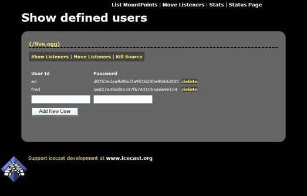
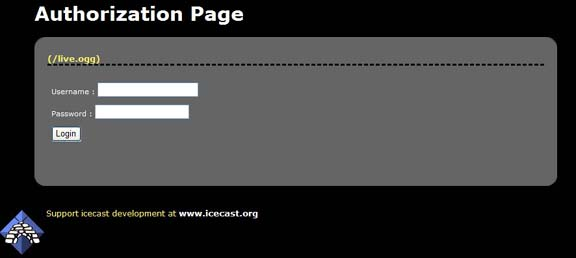

<article markdown="1">
# Listener Authentication
Listener authentication is a feature of Icecast which allows you to secure a certain mountpoint such that in order to listen,
a listener must pass some verification test. With this feature, a simple pay-for-play operation (eg. user/pass), or some filtering
based on the listener connection can be performed. This section will show you the basics of setting up and maintaining this component.

</article>

<article markdown="1">
# htpasswd Listener Authentication

## Config File Entries

In order to use listener authentication, you __must__ configure a mount specific option. This means that you have to provide
a `<mount>` section in the main icecast config file. The following is an example:


<mount>
	<mount-name>/example.ogg</mount-name>
	<authentication type="htpasswd">
		<option name="filename" value="myauth"/>
		<option name="allow_duplicate_users" value="0"/>
	</authentication>
</mount>


To support listener authentication you __must__ provide at a minimum `<mount-name>` and `<authentication>`.  
The `mount-name` is the name of the mountpoint that you will use to connect your source client with and `authentication` configures
what type of Icecast authenticator to use.  
Currently, only `htpasswd` and `url` are implemented. Each authenticator has a variable number of options that are required and
these are specified as shown in the example.  
The htpasswd authenticator requires a few parameters:  
The first, `filename`, specifies the name of the file to use to store users and passwords. Note that this file need not exist
(and probably will not exist when you first set it up).  
Icecast has built-in support for managing users and passwords via the web admin interface. More on this later in this section.  
The second option, `allow_duplicate_users`, if set to `0`, will prevent multiple connections using the same username. Setting this
value to `1` will enable mutltiple connections from the same username on a given mountpoint.  
Note there is no way to specify a “max connections” for a particular user.  
  
Icecast supports a mixture of streams that require listener authentication and those that do not. Only mounts that are named in the config file can be configured for listener authentication.

## Configuring Users and Passwords
Once the appropriate entries are made to the config file, connect your source client (using the mountpoint you named in
the config file). To configure users and passwords for this stream you must use the web-based admin interface. Navigate to
`http://server:ip/admin/stats.xsl` to begin. If you have configured everything properly, you should see a screen like the
following:

You will see a lock in front of all mountpoint configured for listener authentication. Also note that this page will
only show _connected_ mountpoints.

To manage users and passwords for this mountpoint, click on the “Manage Authentication” link. The following screen will be shown:

This screen will show all the users configured for this mountpoint. Adding users is as simple as entering a username and password
in the fields and clicking “Add New User”.  
Note that usernames __must__ be unique and there are __no__ restrictions on passwords. You can delete users by clicking the appropriate
delete link next to each user.

## Finishing it all off
Ok, so you've created your users, and you have everything setup properly, how do your users login? Well, we've provided a simple login
form that you can use for this purpose. This page (`http://server:port/auth.xsl`) will bring up a form that users can use to enter their
username and password.

This page will serve a m3u with the username and password and in most cases should open the correct media player and begin playing your stream.

</article>

<article markdown="1">
# A note about players and authentication
We do not have an exaustive list of players that support listener authentication.  
We use standard HTTP basic authentication, and in general, many media players support this if they support anything at all.
Winamp and Foobar2000 support HTTP basic authentication on Windows, and XMMS supports it on UNIX platforms.

</article>