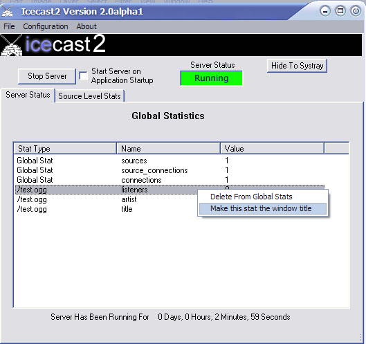
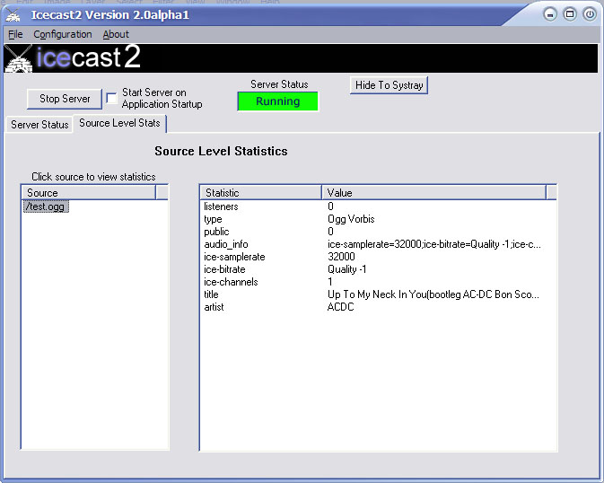

# Overview
The win32 port of icecast2 is simply a UI framework around the core Icecast 2 server.
The win32 version of Icecast 2 directly uses the main executable of Icecast (statically included)
and simply provides a GUI interface to Icecast 2.  
  
Most of the features of Icecast 2 are available in the Win32 port.  
__A notable absence is IPv6 support.__

# Server Status Tab

The server status tab contains information regarding statistics that are global to the server. There are two types of statistics in icecast2: source level and global statistics. Global statistics are cumulative stats from all sources offered by the server. Source level statistics are stats which apply only to a single source attached to the server.
  
Examples of global statistics are:  

<pre>
The number of current sources connected
The number of sources that have attempted connections
Total number of attempted connections to the server
</pre>

The Server Status tab contains at a minimal the global stats for the server. Additionally, you may add source specific stats to this tab. The intent is to provide a single "dashboard view" of what's going on in the server. To add source statistics to the Server Status tab, see the section on the Stats tab.

## Adding stats to the window title
Any stat that is contained on the Server Status tab can be displayed as the Icecast 2 window title. This provides yet another mechanism by which you can view activities on the server. To enable this feature, right click on any stat in the Server Status tab as seen below:  

## Removing source level stats from the Server Status Tab
To remove a source level stat that you have inserted onto the Server Status Tab, simple right click that statistic and select "Delete from Global Stats". The stat will be deleted from the Server Status tab, but will still remain on the source level Stats tab.

# Editing The Icecast Config File
Editing the icecast2 configuration file is a very simple process. For a description of what each field means, see the main icecast documenation. Changes to the icecast2 configuration can only be done while the server is stopped. To edit the current server configuration file, select "Configuration/Edit Configuration" from the main menu.

# Stats Tab
The stats tab contains a view of all the connected mountpoints and the statistics that go along with them. Each connected mountpoint is displayed in the left pane of the window, and all stats for the selected mountpoint are displayed in the right pane of the window.  

