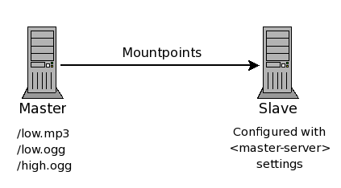
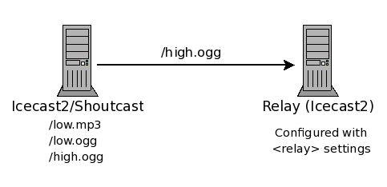

<article markdown="1">
# Overview
This section will describe each section of the config file and is grouped into the following sections:

-   [Limits](#limits)
-   [Authentication](#authentication)
-   [Stream Directory Settings](#yp)
-   [Misc Server settings](#misc)
-   [Relay settings](#relay)
-   [Mount Specific settings](#mountsettings)
-   [File path settings](#path)
-   [Logging](#log)
-   [Security](#security)

</article>

<article markdown="1">
# A word of warning
Please note that, especially for new Icecast users, editing the config file can be quite tricky.
**It is thus recommended to make a backup of the original config file and then start by just changing all
passwords, nothing else.** You can then use the source-password to bring up an initial stream and get more
comfortable with how Icecast works.  
  
Should you need to customize the configuration, then make a backup of your working config file, before you
make any changes. If Icecast refuses to start it is in most cases due to a malformed config file. In such a
case running the following command should point out most XML syntax problems.

    xmllint icecast.xml

A known limitation of Icecast 2.4.0 is that it will segfault on empty XML tags, so please
don't use them (e.g. `<webroot></webroot>`).  
  
Also check the Icecast error.log for additional hints in case of all problems!

</article>

<article markdown="1">
# Limits
{:#limits}


<limits>
    <clients>100</clients>
    <sources>2</sources>
    <queue-size>102400</queue-size>
    <client-timeout>30</client-timeout>
    <header-timeout>15</header-timeout>
    <source-timeout>10</source-timeout>
    <burst-on-connect>1</burst-on-connect>
    <burst-size>65536</burst-size>
</limits>


This section contains server level settings that, in general, do not need to be changed.
Only modify this section if you know what you are doing.

clients
: Total number of concurrent clients supported by the server. Listeners are considered clients,
  but so are accesses to any static content (i.e. fileserved content) and also any requests to
  gather stats. These are max concurrent connections for the entire server (not per mountpoint).

sources
: Maximum number of connected sources supported by the server. This includes active relays and source clients

queue-size
: This is the maximum size (in bytes) of the stream queue. A listener may temporarily
  lag behind due to network congestion and in this case an internal queue is maintained for the
  listeners. If the queue grows larger than this config value, then it is truncated and any listeners
  found will be removed from the stream. This will be the default setting for the streams which is
  512k unless overridden here. You can override this in the individual mount settings which can be
  useful if you have a mixture of high bandwidth video and low bitrate audio streams.

client-timeout
: This does not seem to be used.

header-timeout
: The maximum time (in seconds) to wait for a request to come in once the client has made a connection
  to the server. In general this value should not need to be tweaked.

source-timeout
: If a connected source does not send any data within this timeout period (in seconds),
  then the source connection will be removed from the server.

burst-on-connect
: This setting is really just an alias for burst-size. When enabled the burst-size is 64 kbytes and
  disabled the burst-size is 0 kbytes. This option is deprecated, use `burst-size` instead.

burst-size
: The burst size is the amount of data (in bytes) to burst to a client at connection time. Like burst-on-connect,
  this is to quickly fill the pre-buffer used by media players. The default is 64 kbytes which is a typical size used by
  most clients so changing it is not usually required. This setting applies to all mountpoints unless overridden in
  the mount settings. Ensure that this value is smaller than queue-size, if necessary increase queue-size to be larger
  than your desired burst-size. Failure to do so might result in aborted listener client connection attempts, due to
  initial burst leading to the connection already exceeding the queue-size limit.

</article>

<article markdown="1">
# Authentication
{:#authentication}


<authentication>
    <source-password>hackme</source-password>
    <relay-user>relay</relay-user>
    <relay-password>hackme</relay-password>
    <admin-user>admin</admin-user>
    <admin-password>hackme</admin-password>
</authentication>


This section contains all the usernames and passwords used for administration purposes or to connect sources and relays.

source-password
: The unencrypted password used by sources to connect to Icecast. The default username for all 
  source connections is 'source' but this option allows to specify a default password. This and the
  username can be changed in the individual mount sections.

relay-user
: Used in the master server as part of the authentication when a slave requests the list of streams
  to relay. The default username is `relay`

relay-password
: Used in the master server as part of the authentication when a slave requests the list of streams to relay.

admin-user/admin-password
: The username/password used for all administration functions. This includes retrieving statistics, accessing the web-based
  administration screens, etc. A list of these functions can be found in the "Administration" section of the manual.

</article>

<article markdown="1">
# Stream Directory Settings
{:#yp}


<directory>
    <yp-url-timeout>15</yp-url-timeout>
    <yp-url>http://dir.xiph.org/cgi-bin/yp-cgi</yp-url>
</directory>


This section contains all the settings for listing a stream on any of the Icecast YP Directory servers.
Multiple occurances of this section can be specified in order to be listed on multiple directory servers.

yp-url-timeout
: This value is the maximum time Icecast will wait for a response from a particular directory server.
  The recommended value should be sufficient for most directory servers.

yp-url
: The URL which Icecast uses to communicate with the Directory server.
  The value for this setting is provided by the owner of the Directory server.

</article>

<article markdown="1">
# Misc Server Settings
{:#misc}

## Server wide settings


<hostname>localhost</hostname>
<location>earth</location>
<admin>icemaster@localhost</admin>
<fileserve>1</fileserve>
<server-id>icecast 2.3</server-id>


hostname
: This is the DNS name or IP address that will be used for the stream directory lookups or
  possibily the playlist generation if a Host header is not provided. While localhost is shown as
  an example, in fact you will want something that your listeners can use.

location
: This sets the location string for this Icecast instance. It will be shown e.g in the web interface.

admin
: This should contain contact details for getting in touch with the server administrator.
  Usually this will be an email address, but as this can be an arbitrary string it could also
  be a phone number. This will be shown e.g. in the web interface.

fileserve
: This flag turns on the icecast2 fileserver from which static files can be served. All files
  are served relative to the path specified in the `<paths><webroot>` configuration setting.
  By default the setting is enabled so that requests for the images on the status page are retrievable.

server-id
: This optional setting allows for the administrator of the server to override the default
  server identification. The default is `icecast` followed by a version number and most will
  not care to change it however this setting will change that.  
  

The following shows how you can specify the listening settings for the server.

The first shows an example of a common and simple way to define a listening socket:


<listen-socket>
    <port>8000</port>
</listen-socket>


Using this as a basis we can extend this with an `<bind-address>` setting to limit which address Icecast
will listen on. Most will not need to use bind-address and often get confused by using it when there is
no need. Another possibility is to use an `<ssl>` boolean setting which informs Icecast that a secured
connection is to be used. A common use for using a secure connection would be for admin page access.  
  
The following shows how we can extend a single listen-socket to work with Shoutcast style source clients.
There are two issues shoutcast source clients have over icecast source clients, one is the lack of mountpoint
and the second is the requirement of two ports. Both of these issues are handled by a simple addition in
the listen-socket.


<listen-socket>
    <port>8000</port>
    <shoutcast-mount>/live.mp3</shoutcast-mount>
</listen-socket>


As before the port specified is allocated but this time the shoutcast-mount implicity defines a second
listening socket whose port number is always one higher than the port defined, this also informs icecast
of which mountpoint the shoutcast source client on this socket will be using. Using this approach you can
allow multiple shoutcast source clients to connect at the same time.  
  
The following is just to show the longer approach to defining shoutcast compatability.


<shoutcast-mount>/live.nsv</shoutcast-mount>
<!-- You may have multiple <listen-socket> elements -->
<listen-socket>
    <port>8000</port>
</listen-socket>

<listen-socket>
    <port>8001</port>
    <shoutcast-compat>1</shoutcast-compat>
</listen-socket>


Note that multiple listen-socket sections may be configured in order to have Icecast listen on multiple network
interfaces or multiple ports. If a bind-address is not specified for a particular listen-socket, then the socket
will be bound to all interfaces (including IPv6 if available). For most people, the bind-address option will not
be required and often confuses people.

port
: The TCP port that will be used to accept client connections.

bind-address
: An optional IP address that can be used to bind to a specific network
  card. If not supplied, then it will bind to all interfaces.

shoutcast-mount
: An optional mountpoint setting to be used when shoutcast DSP compatible clients connect. The default global setting
  is `/stream` but can be overridden here to use an alternative name which may include an extension that some clients
  require for certain formats.  
  Defining this within a listen-socket group tells Icecast that this port and the subsequent port are to be used for
  Shoutcast compatible source clients. This is an alternative to the `shoutcast-compat` approach as this implicitly
  defines the second listening socket and allows for specifying multiple sockets using different mountpoints for
  shoutcast source clients. The `shoutcast-mount` outside of a `listen-socket` group is the global setting of the
  mountpoint to use.

shoutcast-compat
: This optional flag will indicate that this port will operate in Shoutcast compatibility mode. Due to major differences
  in the source client connection protocol, if you wish to use any of the shoutcast DJ tools, you will need to configure
  at least one socket as shoutcast-compatible. Note that when in this mode, only source clients (and specifically shoutcast
  source clients) will be able to attach to this port. All listeners may connect to any of the ports defined without this flag.
  Also, for proper Shoutcast DSP compatibility, you must define a listen socket with a port one less than the one defined as
  `shoutcast-compat`. This means if you define `8001` as `shoutcast-compat`, then you will need to define a listen port
  of `8000` and it must not also be defined as `shoutcast-compat`. See the example config file in the distribution for more info.

</article>

<article markdown="1">
# Relaying Streams
{:#relay}

This section contains the servers relay settings. The relays are implemented using a pull system where the receiving
server connects as if its a listener to the sending server.  
There are two types of relay setups:  
a "Master server relay" or a "Specific Mountpoint relay."

## Master Relay

A Master server relay is only supported between Icecast servers and is used to relay a number of
mountpoints from a remote Icecast server.


<master-server>127.0.0.1</master-server>
<master-server-port>8001</master-server-port>
<master-update-interval>120</master-update-interval>
<master-username>relay</master-username>
<master-password>hackme</master-password>
<relays-on-demand>0</relays-on-demand>


The following diagram shows the basics of using a Master relay.  
Please note that the slave is configured with the `<master-server>`, `<master-server-port>`, etc… settings
and the master is the Icecast server from which the slave will pull mountpoints and relay them. Using a
Master server relay, all non-hidden mountpoints on the master can be
relayed using this mechanism.  

  
A server is configured as a Master Server relay by specifying the `<master-server>`, `<master-server-port>`, 
`<master-update-interval>`, `<master-password>` values in the config file. The server that is being relayed
does not need any special configuration.

master-server
: This is the IP for the server which contains the mountpoints to be relayed (Master Server).

master-server-port
: This is the TCP Port for the server which contains the mountpoints to be relayed (Master Server).

master-update-interval
: The interval (in seconds) that the Relay Server will poll the Master Server for any new mountpoints to relay.

master-username
: This is the relay username on the master server. It is used to query the server for a list of mountpoints to
  relay. If not specified then `relay` is used.

master-password
: This is the relay password on the Master server. It is used to query the server for a list of mountpoints to
  relay.

relays-on-demand
: Global on-demand setting for relays. Because you do not have individual relay options when using a master server
  relay, you still may want those relays to only pull the stream when there is at least one listener on the slave.
  The typical case here is to avoid surplus bandwidth costs when no one is listening.  
  

## Specific Mountpoint Relay

If only specific mountpoints need to be relayed, then you can configure Icecast with a "Specific Mountpoint Relay".

The following diagram shows the basics of using a Specific Mountpoint relay. Note that the relaying Icecast is
configured with the `<relay>` settings and will pull the specified mountpoint(s) and relay them to the listeners.
Using a Specific Mountpoint Relay, only those mountpoints specified will be relayed. 

Specific Mountpoint Relays can be configured to relay from an Icecast 2 server, as well as Icecast 1.x and Shoutcast.
A server is configured as a Specific Mountpoint Server relay by specifying a `<relay>` XML chunk in the config file
for each mountpoint to be relayed. The server that is being relayed does not need any special configuration.


<relay>
    <server>127.0.0.1</server>
    <port>8001</port>
    <mount>/example.ogg</mount>
    <local-mount>/different.ogg</local-mount>
    <username>joe</username>
    <password>soap</password>
    <relay-shoutcast-metadata>0</relay-shoutcast-metadata>
    <on-demand>1</on-demand>
</relay>


server
: This is the IP for the server which contains the mountpoint to be relayed.

port
: This is the TCP Port for the server which contains the mountpoint to be relayed.

mount
: The mountpoint located on the remote server. If you are relaying a shoutcast stream,
  this should be a `/` or `/name`.

local-mount
: The name to use for the local mountpoint. This is what the mount will be named on the relaying server.
  By default the remote mountpoint name is used.

username
: The source of the relay may require authentication itself, if so state the username here.

password
: The source of the relay may require authentication itself, if so state the password here.

relay-shoutcast-metadata
: If you are relaying a Shoutcast stream, you may want to specify this indicator to also relay the metadata
  (song titles) that are part of the Shoutcast data stream. By default this is enabled
  but it is up to the remote server on whether it sends any.  
  `1`: enabled, `2`: disabled

on-demand
: An on-demand relay will only retrieve the stream if there are listeners requesting the stream.
  `1`: enabled, `0`: disabled (default is `<relays-on-demand>`). This is useful in cases where you want to
  limit bandwidth costs when no one is listening.

</article>

<article markdown="1">
# Mount Specific Settings
{:#mountsettings}


<mount>
    <mount-name>/example-complex.ogg</mount-name>
    <username>othersource</username>
    <password>hackmemore</password>
    <max-listeners>1</max-listeners>
    <max-listener-duration>3600</max-listener-duration>
    <dump-file>/tmp/dump-example1.ogg</dump-file>
    <intro>/intro.ogg</intro>
    <fallback-mount>/example2.ogg</fallback-mount>
    <fallback-override>1</fallback-override>
    <fallback-when-full>1</fallback-when-full>
    <charset>ISO8859-1</charset>
    <public>1</public>
    <stream-name>My audio stream</stream-name>
    <stream-description>My audio description</stream-description>
    <stream-url>http://some.place.com</stream-url>
    <genre>classical</genre>
    <bitrate>64</bitrate>
    <type>application/ogg</type>
    <subtype>vorbis</subtype>
    <hidden>1</hidden>
    <burst-size>65536</burst-size>
    <mp3-metadata-interval>4096</mp3-metadata-interval>
    <authentication type="xxxxxx">
            <!-- See listener authentiaction documentation -->
    </authentication>
    <on-connect>/home/icecast/bin/source-start</on-connect>
    <on-disconnect>/home/icecast/bin/source-end</on-disconnect>
</mount>


This section contains the settings which apply only to a specific mountpoint and applies to an incoming
stream whether it is a relay or a source client. The purpose of the mount definition is to state certain
information that can override either global/default settings or settings provided from the incoming stream.

A mount does not need to be stated for each incoming source although you may want to specific certain settings
like the maximum number of listeners or a mountpoint specific username/password. As a general rule, only define
what you need to but each mount definition needs at least the mount-name. Changes to most of these will apply
across a configuration file re-read even on active streams, however some only apply when the stream starts or
ends.

mount-name
: The name of the mount point for which these settings apply.

username
: An optional value which will set the username that a source must use to connect using this mountpoint.
  Do not set this value unless you are sure that the source clients connecting to the mount point can be
  configured to send a username other than `source`.  
  If this value is not present the default username is `source`.

password
: An optional value which will set the password that a source must use to connect using this mountpoint.
  There is also a [URL based authentication method](auth.html#stream-auth) for sources that can be used instead.

max-listeners
: An optional value which will set the maximum number of listeners that can be attached to this mountpoint.

max-listener-duration
: An optional value which will set the length of time a listener will stay connected to the stream.  
  An auth component may override this.

dump-file
: An optional value which will set the filename which will be a dump of the stream coming through 
  on this mountpoint. This filename is processed with strftime(3). This allows to use variables like `%F`.

intro
: An optional value which will specify the file those contents will be sent to new listeners when they
  connect but before the normal stream is sent. Make sure the format of the file specified matches the
  streaming format. The specified file is appended to webroot before being opened.

fallback-mount
: This optional value specifies a mountpoint that clients are automatically moved
  to if the source shuts down or is not streaming at the time a listener connects. Only one can be
  listed in each mount and should refer to another mountpoint on the same server that is streaming in
  the same streaming format.  
  If clients cannot fallback to another mountpoint, due to a missing
  fallback-mount or it states a mountpoint that is just not available, then those clients will be
  disconnected. If clients are falling back to a mountpoint and the fallback-mount is not actively
  streaming but defines a fallback-mount itself then those clients may be moved there instead. This
  multi-level fallback allows clients to cascade several mountpoints.  
  A fallback mount can also state a file that is located in webroot. This is useful for playing a
  pre-recorded file in the case of a stream going down. It will repeat until either the listener
  disconnects or a stream comes back available and takes the listeners back. As per usual, the file
  format should match the stream format, failing to do so may cause problems with playback.  
  Note that the fallback file is not timed so be careful if you intend to relay this. They are fine
  on slave streams but don't use them on master streams, if you do then the relay will consume stream
  data at a faster rate and the listeners on the relay would eventually get kicked off.

fallback-override
: When enabled, this allows a connecting source client or relay on this mountpoint to move listening
  clients back from the fallback mount.

fallback-when-full
: When set to `1`, this will cause new listeners, when the max listener count for the mountpoint has
  been reached, to move to the fallback mount if there is one specified.

<del>no-yp</del> (deprecated)
: Setting this option prevents this mountpoint from advertising on YP. The default is `0` so YP advertising
  can occur however you may want to prevent it here if you intend listeners to connect to a local relay instead.  
  Deprecated option, replaced by `<public>`

charset
: For non-Ogg streams like MP3, the metadata that is inserted into the stream often has no defined character set.
  We have traditionally assumed UTF8 as it allows for multiple language sets on the web pages and stream directory,
  however many source clients for MP3 type streams have assumed Latin1 (ISO 8859-1) or leave it to whatever character
  set is in use on the source client system.  
  This character mismatch has been known to cause a problem as the stats engine and stream directory servers want UTF8
  so now we assume Latin1 for non-Ogg streams (to handle the common case) but you can specify an alternative character
  set with this option.  
  The source clients can also specify a `charset=` parameter to the metadata update URL if they so wish.

public
: The default setting for this is `-1` indicating that it is up to the source client or relay to determine if this mountpoint
  should advertise. A setting of `0` will prevent any advertising and a setting of `1` will force it to advertise. 
  If you do force advertising you may need to set other settings listed below as the YP server can refuse to advertise
  if there is not enough information provided.

stream-name
: Setting this will add the specified name to the stats (and therefore YP) for this mountpoint even if the source client/relay provide one.

stream-description
: Setting this will add the specified description to the stats (and therefore YP) for this mountpoint even if the source client/relay provide one.

stream-url
: Setting this will add the specified URL to the stats (and therefore YP) for this mountpoint even if the source client/relay provide one.  
  The URL is generally for directing people to a website.

genre
: Setting this will add the specified genre to the stats (and therefore YP) for this mountpoint even if the source client/relay provide one.  
  This can be anything be using certain key words can help searches in the YP directories.

bitrate
: Setting this will add the specified bitrate to the stats (and therefore YP) for this mountpoint even if the source client/relay provide one.  
  This is stated in kbps.

type
: Setting this will add the specified mime type to the stats (and therefore YP) for this mountpoint even if the source client/relay provide one.  
  It is very unlikely that this will be needed.

subtype
: Setting this will add the specified subtype to the stats (and therefore YP) for this mountpoint.
  The subtype is really to help the YP server to identify the components of the type.
  An example setting is vorbis/theora do indicate the codecs in an Ogg stream

burst-size
: This optional setting allows for providing a burst size which overrides the default burst size as defined in limits.  
  The value is in bytes.

mp3-metadata-interval
: This optional setting specifies what interval, in bytes, there is between metadata updates within shoutcast compatible streams.
  This only applies to new listeners connecting on this mountpoint, not existing listeners falling back to this mountpoint. The
  default is either the hardcoded server default or the value passed from a relay.

hidden
: Enable this to prevent this mount from being shown on the xsl pages. This is mainly for cases where a local relay is configured
  and you do not want the source of the local relay to be shown.

authentication
: This specifies that the named mount point will require listener (or source) authentication. Currently, we support a file-based
  authentication scheme (`type=htpasswd`) and URL based authentication request forwarding. A mountpoint configured with an authenticator
  will display a red key next to the mount point name on the admin screens.  
  You can read more about listener authentication and URL based source authentication [here](auth.html).

on-connect
: State a program that is run when the source is started. It is passed a parameter which is the name of the mountpoint that is starting.
  The processing of the stream does not wait for the script to end.  
  _This option is not available on Win32_

on-disconnect
: State a program that is run when the source ends. It is passed a parameter which is the name of the mountpoint that has ended.
  The processing of the stream does not wait for the script to end.  
  _This option is not available on Win32_

</article>

<article markdown="1">
# Path Settings
{:#path}


<paths>
    <basedir>./</basedir>
    <logdir>./logs</logdir>
    <pidfile>./icecast.pid</pidfile>
    <webroot>./web</webroot>
    <adminroot>./admin</adminroot>
    <allow-ip>/path/to/ip_allowlist</allow-ip>
    <deny-ip>/path_to_ip_denylist</deny-ip>
    <alias source="/foo" dest="/bar"/>
</paths>


This section contains paths which are used for various things within icecast. All paths (other than any aliases) should not end in a `/`.

basedir
: This path is used in conjunction with the chroot settings, and specified the base directory that is chrooted to when the server is started.  
  _This feature is not supported on Win32._

logdir
: This path specifies the base directory used for logging. Both the `error.log` and `access.log` will be created relative to this directory.

pidfile
: This pathname specifies the file to write at startup and to remove at normal shutdown. The file contains the process id of the icecast process.  
  This could be read and used for sending signals to Icecast.

webroot
: This path specifies the base directory used for all static file requests. This directory can contain all standard file types
  (including mp3s and ogg vorbis files). For example, if webroot is set to `/var/share/icecast2`, and a request for
  `http://server:port/mp3/stuff.mp3` comes in, then the file `/var/share/icecast2/mp3/stuff.mp3` will be served.

adminroot
: This path specifies the base directory used for all admin requests. More specifically, this is used to hold the XSLT scripts used
  for the web-based admin interface. The admin directory contained within the icecast distribution contains these files.

allow-ip
: If specified, this specifies the location of a file that contains a list of IP addresses that will be allowed to connect to Icecast.
  This could be useful in cases where a master only feeds known slaves.  
  The format of the file is simple, one IP per line.

deny-ip
: If specified, this specifies the location of a file that contains a list of IP addressess that will be dropped immediately.
  This is mainly for problem clients when you have no access to any firewall configuration.  
  The format of the file is simple, one IP per line.

alias
: Aliases are used to provide a way to create multiple mountpoints that refer to the same mountpoint.  
  For example: `<alias source="/foo" dest="/bar">`

</article>

<article markdown="1">
# Logging Settings
{:#log}


<logging>
    <accesslog>access.log</accesslog>
    <errorlog>error.log</errorlog>
    <playlistlog>playlist.log</playlistlog>
    <loglevel>4</loglevel> <!-- 4 Debug, 3 Info, 2 Warn, 1 Error -->
</logging>


This section contains information relating to logging within Icecast. There are three logfiles currently generated by Icecast,
an `error.log` (where all log messages are placed), an `access.log` (where all stream/admin/http requests are logged) and an
optional `playlist.log`.  
  
Note that on non-win32 platforms, a HUP signal can be sent to Icecast in which the log files are re-opened for appending giving the ability move/remove the log files.  
  
If you set any of the filenames to a simple dash (e.g. `<accesslog>-</accesslog>`) then Icecast will direct the log output to
STDERR instead of a file.

accesslog
: Into this file, all requests made to the icecast2 will be logged. This file is relative to the path specified by the `<logdir>` config value.

errorlog
: All Icecast generated log messages will be written to this file. If the loglevel is set too high (Debug for instance) then
  this file can grow fairly large over time. Currently, there is no log-rotation implemented.

playlistlog
: Into this file, a log of all metadata for each mountpoint will be written. The format of the logfile will most likely change over time
  as we narrow in on a standard format for this. Currently, the file is pipe delimited. This option is optional and can be removed entirely
  from the config file.

logsize
: This value specifies (in Kbytes) the maxmimum size of any of the log files. When the logfile grows beyond this value, icecast will either
  rename it to `logfile.old`, or add a timestamp to the archived file (if logarchive is enabled).

logarchive
: If this value is set, then Icecast will append a timestamp to the end of the logfile name when logsize has been reached. If disabled, then
  the default behavior is to rename the logfile to `logfile.old` (overwriting any previously saved logfiles). We disable this by default to
  prevent the filling up of filesystems for people who don't care (or know) that their logs are growing.

loglevel
: Indicates what messages are logged by icecast. Log messages are categorized into one of 4 types, Debug, Info, Warn, and Error.  
    
  The following mapping can be used to set the appropraite value:
  
  -   loglevel = `4`: Debug, Info, Warn, Error messages are printed
  -   loglevel = `3`: Info, Warn, Error messages are printed
  -   loglevel = `2`: Warn, Error messages are printed
  -   loglevel = `1`: Error messages only are printed

</article>

<article markdown="1">
# Security Settings
{:#security}


<security>
    <chroot>0</chroot>
    <changeowner>
        <user>nobody</user>
        <group>nogroup</group>
    </changeowner>
</security>


This section contains configuration settings that can be used to secure the icecast server by performing a chroot to a secured location.  
_This is currently not supported on Win32._

chroot
: An indicator which specifies whether a `chroot()` will be done when the server is started.
  The chrooted path is specified by the `<basedir>` configuration value.

changeowner
: This section indicates the user and group that will own the icecast process when it is started.  
  These need to be valid users on the system.

</article>